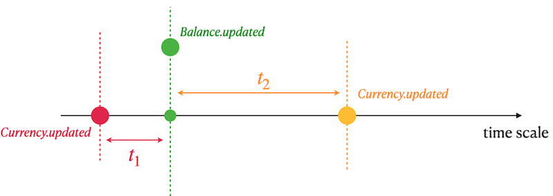

# Currency Table SQL

## _Data Warehouse_

Resume: Today you will know what DWH is and how to create a first ETL process.

## Contents

1. [Chapter I](#chapter-i) \
    1.1. [Preamble](#preamble)
2. [Chapter II](#chapter-ii) \
    2.1. [Instructions](#instructions)
3. [Chapter III](#chapter-iii) \
    3.1. [Exercise 00 - Classical DWH](#exercise-00-classical-dwh)  
4. [Chapter IV](#chapter-iv) \
    4.1. [Exercise 01 - Detailed Query](#exercise-01-detailed-query)  

## Chapter I
## Preamble

A Data Warehousing (DWH) is a process for collecting and managing data from disparate sources to provide meaningful business insights. A data warehouse is typically used to connect and analyze business data from heterogeneous sources. The data warehouse is the core of the BI system built for data analysis and reporting.

## Chapter II
## Instructions

Please download a [script](src/database/model.sql) with Database Model here and apply the script to your database

Please take a look at the Logical View of our Database Model.

## Chapter III
## Exercise 00 Classical DWH

Let's take a look at the data sources and the first logical data layer (ODS - Operational Data Store) in the DWH.

Please write an SQL statement that returns the total volume (sum of all money) of transactions from the user balance aggregated by user and balance type. Note that all data should be processed, including data with anomalies. 

## Chapter IV
## Exercise 01 Detailed Query

Before diving deeper into this task, please apply the following INSERT statements.

`insert into currency values (100, 'EUR', 0.85, '2022-01-01 13:29');`
`insert into currency values (100, 'EUR', 0.79, '2022-01-08 13:29');`

Please write an SQL statement that returns all Users, all Balance transactions (in this task please ignore Currencies that do not have a key in the `Currency` table) with currency name and calculated value of the currency in USD for the next day.

- You need to find a nearest rate_to_usd of currency in the past (t1).
- If t1 is empty (means no rates in the past), then find a nearest rate_to_usd of currency in the future (t2).
- Use t1 OR t2 rate to calculate a currency in USD format.

Sort the result by User Name in descending order and then by User Lastname and Currency name in ascending order.
